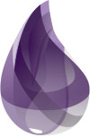

### Hi there 👋, I am Guillaume Milan - aka [Guignomes][https://www.deviantart.com/guignomes]

## I am a developer that like open source project and inovation!

- 🔭 I’m currently working with [Kbrw][https://kbrw.fr]
- 🌱 I’m currently learning 
- 💬 Ask me anything about front-end ( ) or backend with ()

### Connect with me:

[][https://www.linkedin.com/in/guillaume-milan-b7389212b/]

 

### Languages and Tools:

### Thanks

A big thank you to *[codeSTACKr][website]* for his explaination on how to create a greate Readme

<!--
**GuillaumeMilan/GuillaumeMilan** is a ✨ _special_ ✨ repository because its `README.md` (this file) appears on your GitHub profile.

Here are some ideas to get you started:

- 👯 I’m looking to collaborate on ...
- 🤔 I’m looking for help with ...
- 📫 How to reach me: ...
- 😄 Pronouns: ...
- ⚡ Fun fact: ...
-->
