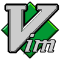

### Hi there 👋, I am Guillaume Milan - aka [Guignomes](https://www.deviantart.com/guignomes)

## I am a developer that like open source project and inovation!

- 🔭 I’m currently working with [Kbrw][kbrw]
- 🌱 I’m currently learning [Erlang][erlang]

### Connect with me:

[][linkedin]

 

## Languages and Tools:

#### Frontend:
[][javascript]
[][react]

#### Backend:
[][elixir-lang]

#### Coding tools:
[][vim]

### Thanks

A big thank you to *[codeSTACKr][codestackrwebsite]* for his explaination on how to create a greate Readme

<!--
**GuillaumeMilan/GuillaumeMilan** is a ✨ _special_ ✨ repository because its `README.md` (this file) appears on your GitHub profile.

Here are some ideas to get you started:

- 👯 I’m looking to collaborate on ...
- 🤔 I’m looking for help with ...
- 📫 How to reach me: ...
- 😄 Pronouns: ...
- ⚡ Fun fact: ...
- 💬 Ask me: ...
-->

[kbrw]: https://kbrw.fr
[codestackrwebsite]: https://www.youtube.com/channel/UCDCHcqyeQgJ-jVSd6VJkbCw
[javascript]: https://developer.mozilla.org/en-US/docs/Web/JavaScript
[react]: https://reactjs.org/
[elixir-lang]: https://elixir-lang.org/
[erlang]: https://www.erlang.org/
[vim]: https://www.vim.org/
[linkedin]: https://www.linkedin.com/in/guillaume-milan-b7389212b/
